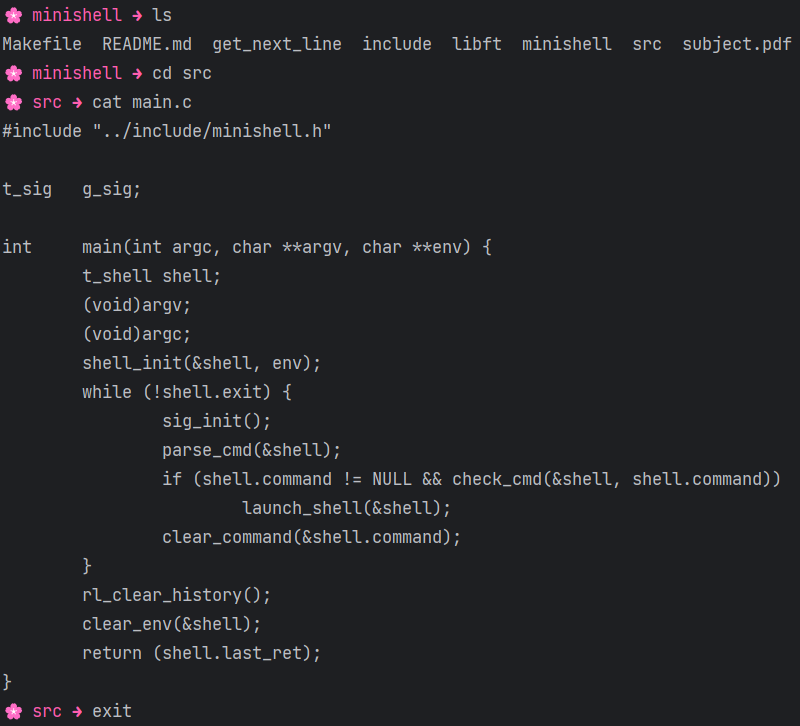

# Minishell ⌨️

Minishell is a simple shell implementation created for the 42 school project. It has been customized again in 2025 to further explore shell functionality and expand its features. 🖥️
*This project only work on linux and wsl.*

## About the project 💻


> You can find [the initial subject here](./assets/subject.pdf).

## Installation 🛠️


You need to install theses command:
```bash
sudo apt-get install make gcc libreadline-dev
```

## Usage 🚀

```bash
make && ./minishell
```
For quiting the program, you need to use `Ctrl` + `D`.

## Authors 🤝

- [@agatocherry](https://www.github.com/agatocherry)
- [@shell02](https://github.com/shell02)
